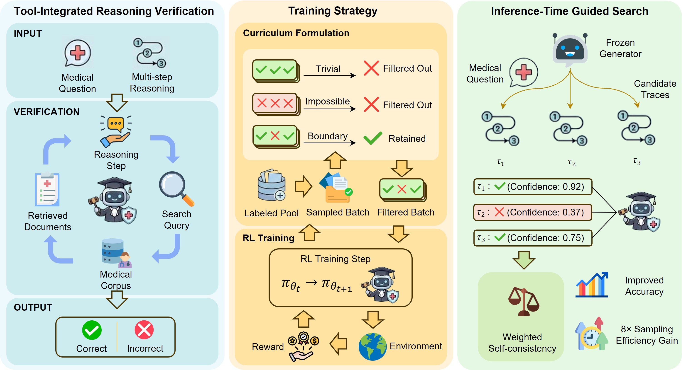

# Scaling Medical Reasoning Verification via Tool-Integrated Reinforcement Learning

This repository is the official implementation of the **Med-TIV** framework in **Scaling Medical Reasoning Verification via Tool-Integrated Reinforcement Learning**.

**Med-TIV** is an agentic RL framework that trains medical reasoning verifiers to dynamically retrieve evidence during judgement.

## 🔥 Key Features

* **Dynamic Knowledge Retrieval:** Enables iterative, context-dependent retrieval during verification rather than static RAG
* **No Step-Level Supervision:** Trains solely through reinforcement learning with trace-level labels—no fine-grained expert annotations required for cold start  
* **Adaptive Curriculum Learning:** Automatically calibrates training difficulty to the evolving model capability via zero-variance filtering
* **8× Sample Efficiency:** Achieves comparable performance to baselines with 8× fewer samples at inference time
* **Generator-Agnostic:** Works as a plug-and-play verifier for any frozen generator model through test-time search

## 📊 Results

Med-TIV substantially boosts medical reasoning verification:

| Model | Size | MedQA | MedMCQA | MMLU-Med | MedXpertQA | Avg. |
|-------|------|-------|---------|----------|------------|------|
| Qwen2.5 | 7B | 60.96 | 56.56 | 76.96 | 12.15 | 51.66 |
| Qwen2.5 | 32B | 73.21 | **64.83** | 84.94 | 13.87 | 59.21 |
| **Med-TIV (Ours)** | **7B** | **75.26** | **64.70** | **85.58** | **16.04** | **60.40** |

* **+23.50%** improvement on MedQA with Hard Weighted Self-Consistency
* **8×** more efficient inference-time guided search than baselines
* Matches **Qwen2.5-32B** performance with a 8B verifier

## 🚀 Quickstart Guide

### 1. Environment Setup

```bash
# Create and activate environment for training
git submodule update --init --recursive
conda create --name verl-tool-env python=3.10
conda activate verl-tool-env
pip install -e verl
pip install -e ".[vllm,acecoder,torl,search_tool]"
pip install "flash-attn==2.8.3" --no-build-isolation

# Create a separate environment for the retrieval server
conda create -n search-retriever python=3.10
conda activate search-retriever
conda install -c pytorch -c nvidia faiss-gpu=1.8.0
pip install transformers datasets fastapi numpy torch uvicorn
```

### 2. Download MedRAG Corpus and Build Index

```bash
# Download medical corpus (PubMed + Textbooks)
python download_medrag.py \
    --corpus combined \
    --output_dir ./data/med_tiv/retriever_index

# Build FAISS index with MedCPT encoder
python build_index.py \
    --corpus_path ./data/med_tiv/retriever_index/medical_combined.jsonl \
    --index_output ./data/med_tiv/retriever_index/medcpt_Flat.index \
    --model ncbi/MedCPT-Article-Encoder \
    --model_name_tag medcpt \
    --pooling cls \
    --batch_size 512 \
    --use_fp16 \
    --gpus 0,1,2,3
```

### 3. Training

```bash
# Run training
bash ./examples/train/search_r1/train_7b_prm_ncbi.sh
```

### 4. Inference

Run inference with the trained verifier:

```bash
# Start all servers (retrieval, tool, API)
bash ./inference/run_medical_judge_inference_multi_file.sh
```

Or manually:

```bash
# 1. Start retrieval server (as above)

# 2. Start tool server  
python inference/medical_dense_retrieval_tool.py \
    --host 0.0.0.0 \
    --port 30150 \
    --retriever_url http://localhost:8000 \
    --topk 3

# 3. Start API service
python eval_service/app.py \
    --model ./checkpoints/med_tiv/iter_2/actor/huggingface \
    --tool_server_url http://localhost:30150/get_observation \
    --max_turns 5 \
    --tensor_parallel_size 4 \
    --gpu_memory_utilization 0.75 \
    --port 5000

# 4. Run inference
python inference/medical_judge_inference.py \
    --input_file ./data/test_traces.json \
    --output_file ./results/evaluations.json \
    --api_base_url http://localhost:5000 \
    --max_tokens 16384 \
    --max_concurrent 32
```

## 📦 Retrieval System

| Component | Configuration |
|-----------|---------------|
| **Corpus** | MedRAG (PubMed + Medical Textbooks, ~24M chunks) |
| **Encoder** | MedCPT-Article-Encoder / MedCPT-Query-Encoder |
| **Index** | FAISS IndexFlatIP |
| **Top-k** | 3 documents per query |

## 🙏 Acknowledgements

This project builds upon:
- [VeRL-Tool](https://github.com/TIGER-AI-Lab/verl-tool) — RL framework for tool-agent training
- [MedRAG](https://huggingface.co/MedRAG) — Medical retrieval corpus  
- [MedCPT](https://github.com/ncbi/MedCPT) — Medical text encoder
- [Med-PRM](https://huggingface.co/datasets/dmis-lab/llama-3.1-medprm-reward-training-set) — Medical process reward model dataset

## 🖊️ Citation

If you find this work helpful, please consider citing our paper:

```bibtex
@article{medtiv2025,
  title={Scaling Medical Reasoning Verification via Tool-Integrated Reinforcement Learning},
  author={Anonymous},
  journal={},
  year={2025}
}
```
